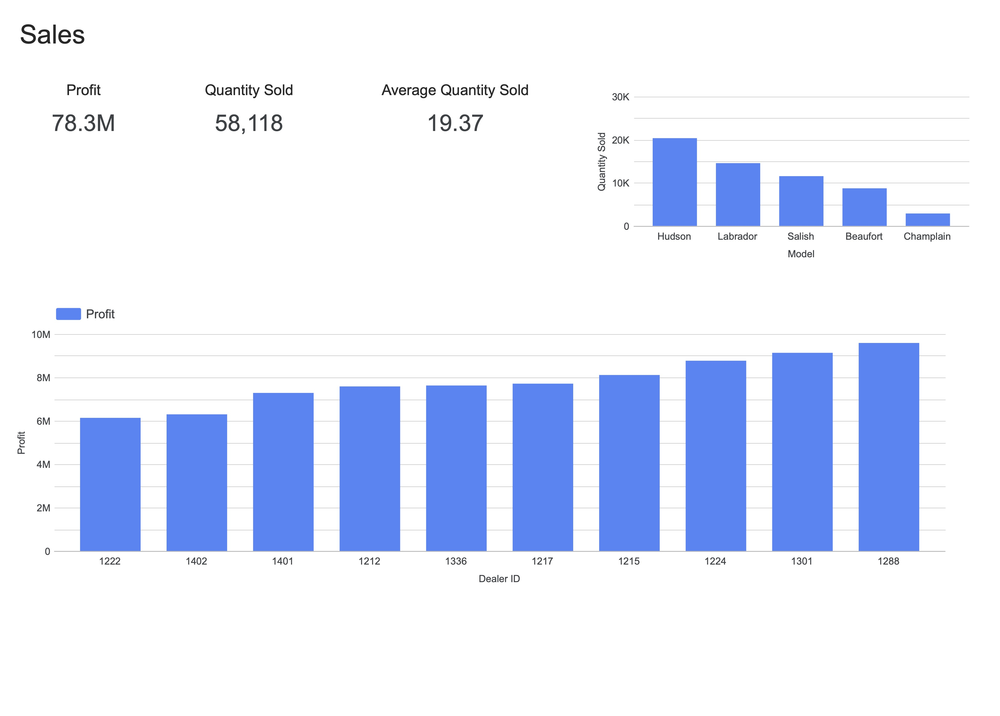

# Automotive Sales & Service Dashboard

An analytics dashboard for a regional car dealership group.
Initially built in **IBM Cognos Analytics** and later re-implemented in **Google Looker Studio** to strengthen cross-tool BI and documentation skills. The project analyzes **sales performance, customer sentiment**, and **service recalls** using modern data visualization techniques.

This hands-on lab was part of the **IBM Data Analyst Professional Certificate**, simulating the role of a **Regional Manager** responsible for monitoring sales and service performance across multiple dealerships.

## Objectives

- Monitor **sales** and **service** performance across dealerships
- Visualize **KPIs**, **sentiment trends**, and **recall data**
- Compare BI capabilities between **Cognos Analytics** and **Looker Studio**

## Dataset

- **Source**: IBM Accelerator Catalog (course-provided subset)
- **Format**: XLSX/CSV (provided by the lab)

## Dashboard Pages & Metrics

### Sales Dashboard

**KPIs:**

- Profit (in millions, 1 decimal precision)
- Total Quantity Sold
- Average Quantity Sold

**Charts:**

- Bar Chart: Quantity Sold by Model
- Column Chart: Profit by Dealer ID (sorted ascending)

### Service Dashboard

**Charts & Insights:**

- Column Chart: Number of Recalls per Car Model
- Treemap: Sentiment Distribution (Positive / Neutral / Negative)
- Line & Column (Combo) Chart: Cars Sold vs. Profit per month
- Heatmap: Recalls by Model and Affected System (to identify recurring faults)

## Implementation

### **1. IBM Cognos Analytics**

- Created two **tabbed dashboards**: Sales and Service.
- Connected and explored the _Auto Group Data Module_ dataset.
- Applied **data formatting** and created visualizations using:
  - **KPI** widgets for profit, quantity sold, and averages.
  - **Bar, column, line-column combo, treemap, and heatmap charts** to analyze sales and service performance.
- Configured **sorting, aggregation, and formatting** options to ensure clarity and business relevance.
- **Exported** final dashboards as professional **PDF reports**.

### **2. Google Looker Studio**

- Built equivalent two-page dashboard (Sales & Service).
- Connected data via **Microsoft Excel and CSV connectors**.
- Recreated Cognos visuals using Looker components.
- Configured colors, labels, and formatting consistency.
- Exported report as **PDF** using Looker’s download feature.

## Deliverables

✅ Two-tab dashboard (Sales & Service) in Cognos  
✅ Two-tab dashboard (Sales & Service) in Looker  
✅ Exported [PDF Dashboard (Cognos)](./visuals/Automotive_Dashboard_Cognos.pdf)  
✅ Exported [PDF Dashboard (Looker)](./visuals/Automotive_Dashboard_Looker.pdf)
