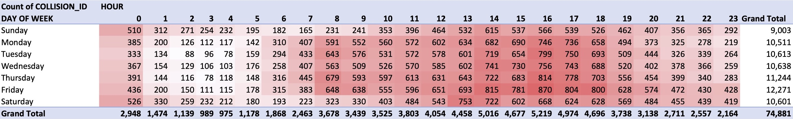
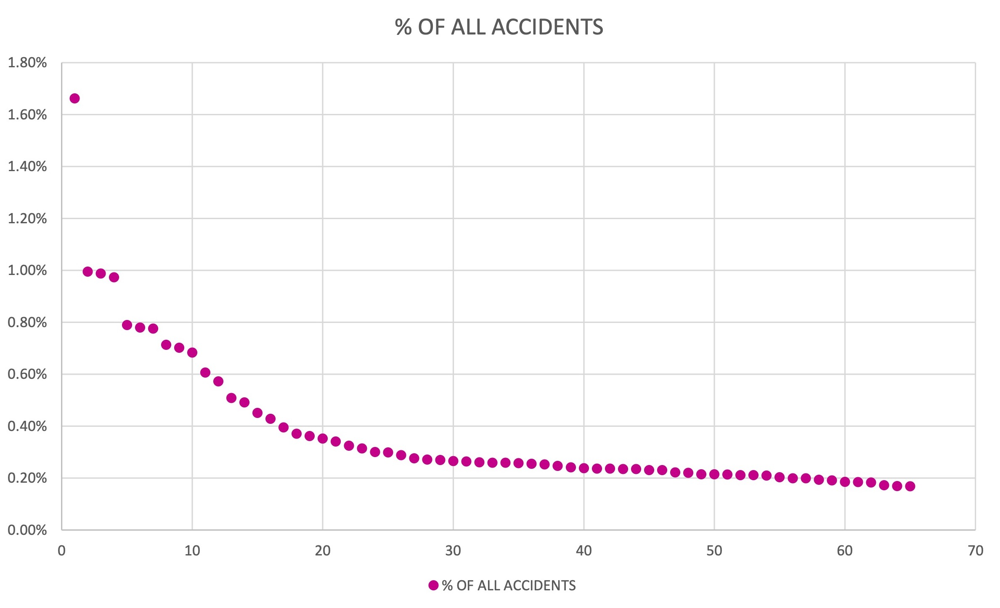
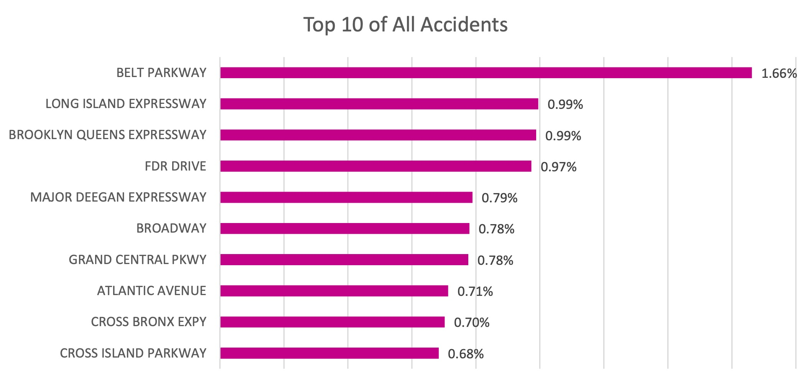
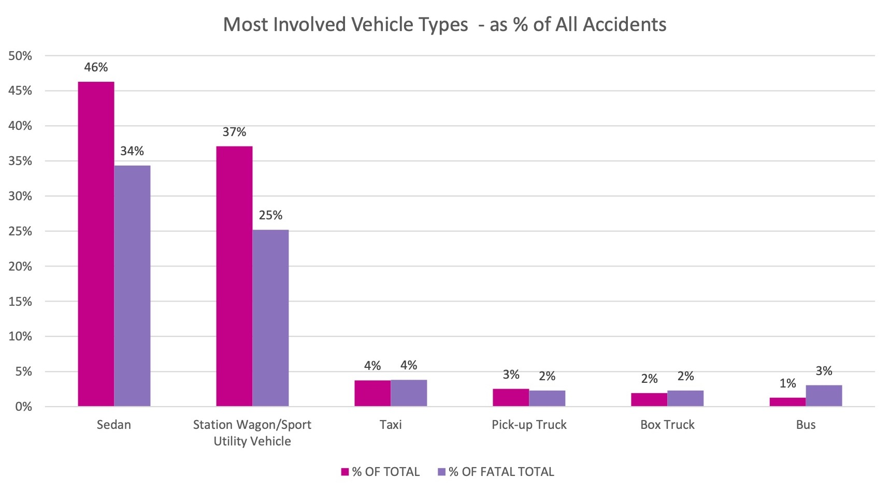

# Excel Implementation

## Data Cleaning & Preparation

1. Used `=ROWS()` and `=COLUMNS()` to check dataset size.
2. Used `Filter` to identify and `=COUNTBLANK()` to measure missing values.
3. Removed columns with 90%+ missing values (Vehicle Type 3–5, Contributing factor 3-5).
4. Standardized column formats:

- Dates → `Date` format
- Times → `Time` format
- Borough, ZIP codes, street names, collision IDs, contributing factors, vehicle types → `Text`
- Lat/Lon → `Number (6 decimals)`
- Number of kills/injures → `Number (no decimals)`.

5. Created **helper columns**:

- Month, Month Name, Day of Week, Is Fatal (True/False) : `Text`
- Hour: `Number`

6. Verified completeness and ensured date range: January – August 2020.

## Analysis & Insights

### 1. Monthly Trends

#### Approach

Created a **Combo Chart (Column + Line)** using a **Pivot Table** to display both **total collisions** (absolute counts) and **percentages of total and fatal accidents** (proportional trends on a secondary axis), aggregated by month. Visualized the relationship between accident **volume** and **severity** over time.

#### Analysis

- Accident frequency was highest in **January** and **February**, then dropped sharply to its lowest point in **April** - aligning with NYC's early COVID-19 lockdown period.
- Collisions began rising again from **May** onward, reaching a secondary peak in **July** and stabilizing in **August** as mobility resumed.
- The percentage of **total accidents** mirrored this pattern, showing a significant dip in **April** before recovering mid-year.
- The percentage of **fatal accidents** increased notably in **June**, even though total crash volume remained moderate - suggesting that fewer **collisions during this period were more severe**.

#### Insights

- Traffic volume declined during lockdown months, but the higher fatality rate in early summer indicates riskier driving behavior during periods of lighter traffic.

### 2. Day-Hour Patterns

#### Approach

Summarized collision frequency and severity by day and hour.  
Visualized overall volume trends across 24 hours.  
Combined **line and radar charts** to effectively capture both **trend shape** and **circular daily rhythm**.

#### Analysis

##### Heatmap: Accidents Hotspots by Day × Hour

- Collision activity is **lowest overnight (1-5 AM)** across all days.
- A strong **morning peak at 8 AM** appears Monday-Friday, weekends don't exhibit the same 8 AM spike.
- The **highest sustained activity** occurs during **2–5 PM** on all days.
- **Friday** shows the **highest afternoon/evening counts**.
- **Weekend early mornings (12–3 AM)** show significantly higher collisions than weekdays.
- **Weekday mornings (7–9 AM)** are markedly busier than weekends.
- All days show a consistent **afternoon rise starting at 11 AM** that **peaks between 2–5 PM**.

##### Accidents Hourly

  
  

- **Collisions are lowest at 2–5 AM**, with the absolute minimum around 4 AM.
- **Sharp increase after 6 AM**, leading to a **strong 8 AM peak** on weekdays, but not weekends.
- Midday: consistently active (9 AM - 1 PM).
- Highest overall collisions occur between **2–5 PM**, with **4 PM** peak hour.
- Evenings: steady decline after **6 PM**.
- Weekends exceed weekdays only during the evening-night hours **(8 PM–5 AM)**; for all other hours of the day, weekday collisions are consistently higher.

##### Total Accidents by Day of Week

- **Friday has the highest number of collisions**.
- **Sunday has the lowest total collisions**.
- The **% of fatal accidents** line diverges from total volume, indicating that severity is not purely a function of how many crashes occur.
- **Sunday, Tuesday, and Saturday** all show **higher share of fatal crashes** than their total collision share would suggest.
- **Friday**, despite having the most collisions, shows a more moderate fatal-share.

#### Insights

- The city's collision "heartbeat" is classic urban: low at night, sharp morning spike, sustained afternoon peak, tapering into the evening.
- Nightlife and late-night travel make weekend early mornings riskier than weekday early mornings.
- Weekday afternoon/early evening, especially Thursday and Friday, is the most collision-dense period of the week.
- **Volume risk** is highest on Fridays - more crashes happen.
- **Severity risk** is higher on Sunday, Tuesday, and Saturday - crashes are more likely to be fatal.

### 3. High-Risk Locations

#### Approach

Used a **PivotTable** to group collisions by **ON STREET NAME**.  
Calculated **total collisions** and **% of all collisions** for each street.  
Sorted in descending order and extracted the Top 10 streets for visualization.  
Created a **horizontal bar chart** to highlight the share each location contributes to the citywide total.

A second PivotTable with a filter `IS FATAL = TRUE` was also created; however, fatal collisions are rare and highly dispersed across locations, resulting in an uninformative Top 10 (mostly 1 fatal crash per street).  
For this reason, **severity patterns are not meaningful by street**.

  
  

#### Analysis

- **Belt Parkway** records the highest collision count at **1.66%** of all crashes, though only slightly above several other major corridors.
- The remaining top locations form a **tight cluster**, each contributing roughly **0.7%-1.0%**.
- Overall, collision volume is **distributed across multiple high-traffic roadways**, with no single location standing out as a strong outlier.

#### Insights

- The highest collision volumes occur on **major expressways and large arterials**.
- **Belt Parkway** leads the list, but only by a small margin - reinforcing that collisions are **distributed across multiple high-demand corridors** rather than concentrated in a single hotspot.
- The overall pattern shows that collision risk is shaped less by any specific street and more by **roadway function**: high-speed expressways and high-activity arterials consistently produce more crashes due to structural and behavioral pressures.
- **Fatal crashes remain too dispersed** across the network to identify meaningful location-based severity patterns - suggesting that **driver behavior (speed, impairment, distraction)** has a larger effect on severity than roadway geometry.

### 4. Contributing factors

#### Approach

Analyzed **why collisions occur, what makes them fatal, and who is most affected**, using **treemaps** for the top causes, a comparison of vehicle types involved in all vs. fatal crashes, and **pie charts** showing the distribution of injuries and fatalities among motorists, pedestrians, and cyclists.

#### Analysis

##### Causes of All Collisions

- **Driver Inattention/Distraction (25.6%)** is the dominant cause of collisions, far outweighing all others.
- **Following Too Closely (7%)** and **Failure to Yield Right-of-Way (6.5%)** reflect congestion-driven, everyday driving mistakes.
- Improper maneuvers - **Passing Improperly, Unsafe Lane Changes, Backing Unsafely** - collectively form a significant share of crashes.
- Overall, most collisions stem from **routine driving behavior errors**, not extreme driving.

##### Causes of Fatal Collisions

- **Unsafe Speed (32%)** becomes the leading cause of fatal crashes, despite its small share of total crashes.
- **Traffic Control Disregarded (14.6%)** and **Failure to Yield (9.7%)** highlight the danger of violations at intersections.
- **Driver Inattention (12.6%)** remains a major contributor, but is overshadowed by speed-driven severity.
- Fatal causes shift from **common errors** to **high-risk behaviors** like speeding and signal violations.

##### Vehicles Most Involved

- **Sedans and SUVs** dominate crash involvement due to road presence, but their fatal shares are **lower** than their total shares.
- **Pick-up trucks, box trucks, and buses** show **higher fatal involvement relative to their total share**, linked to size and impact force.

##### Injured/Killed

  
  

- Motorists are the majority of road users, so they accumulate most injuries.
- Pedestrians' fatality share is more than 2.5× their injury share.
- Cyclists are frequently injured but less represented in fatalities.

#### Insights

- The factors driving collision **frequency** differ from those driving collision **severity**. Everyday mistakes create most crashes, but speed and traffic violations create the deadliest ones.
- **Vehicle mass/size amplifies severity** - heavier vehicles (buses) produce more fatal outcomes relative to their low crash frequency, while common smaller vehicles (sedans, SUVs) dominate volume but not severity.
- **Pedestrians are the most at-risk group**, with a fatality share far exceeding their injury share - crashes involving pedestrians are significantly more lethal.
- **Cyclists' lower fatality share compared to injuries** suggests that lower-speed conditions or protected infrastructure help prevent fatal outcomes.
